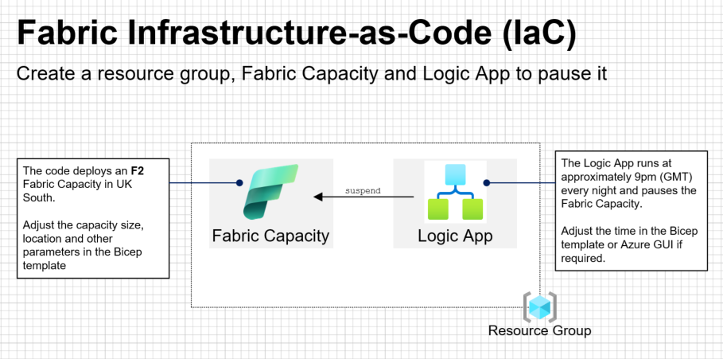
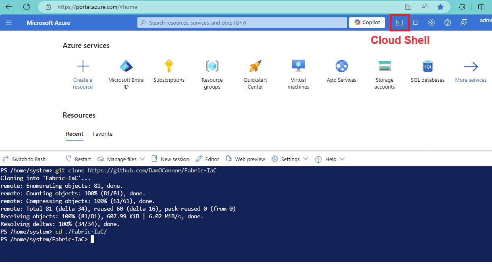
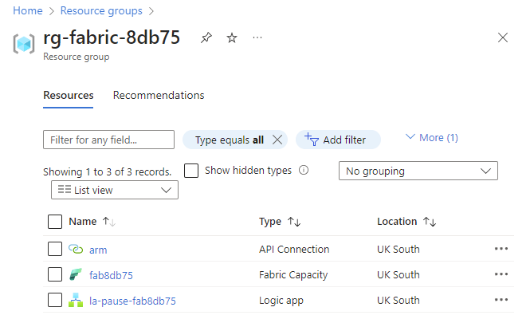
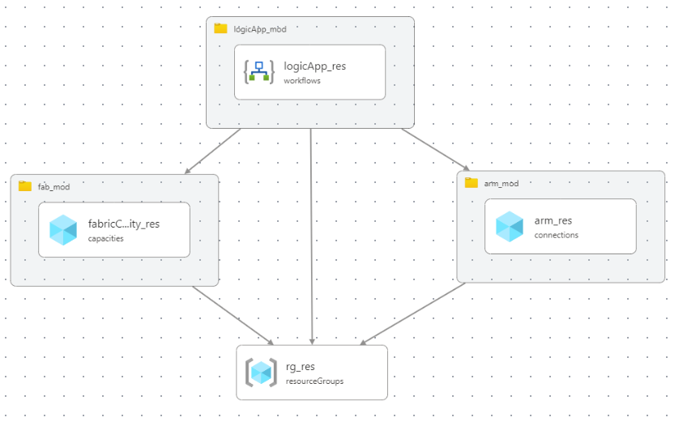

# Fabric-IaC


## Introduction

This repo will create a resource group, an F2 **Fabric Capacity** and a **Logic App** to pause the Fabric Capacity in the UK South region.  Fabric SKU and region can be altered in the Bicep if required.



The code has been built with external subscriptions in mind but could be adapted for any Azure subscription.

> [!NOTE]
> The Bicep template (`main.bicep`) contains code to make sure Azure resource names are unique.  If you run the template multiple times you will get multiple resource groups and Fabric Capacities.  Consider deleting resource groups created in error.  

> If you want to redeploy to the same resource group and keep the other resources, simply override the `uniqueSuffix` in `main.bicep`.


## Contents
- [Prerequisites](#Prerequisites)
- [Steps](#Steps)
- [Completed Deployment](#Completed%20Deployment)
- [Bicep Visualizer](#Bicep%20Visualizer)
- [Clone this repo](#Clone%20this%20repo)


## Prerequisites
- Azure Subscription
- Resource Providers enabled for:
  - `Microsoft.Fabric`
  - `Microsoft.Logic`

See [resourceproviders.ps1](utils/resourceproviders.ps1) for code to enable these resource providers.

**NB** Fabric is not currently available in Microsoft Non-prod / fdpo subscriptions.

Some content sourced from:  
- https://github.com/murggu/fabric-iac
- https://insight-services-apac.github.io/2024/07/23/fabric-bicep

## Steps

1. Login to the Azure CLI either via [Azure Cloud Shell](https://azure.microsoft.com/en-us/get-started/azure-portal/cloud-shell/) or [Visual Studio Code](https://learn.microsoft.com/en-us/cli/azure/authenticate-azure-cli).


### Instructions for VS Code
- clone the repo:
```PowerShell
git clone https://github.com/DamOConnor/Fabric-IaC
```
  - open a Terminal (<kbd>Ctrl</kbd>+<kbd>Shift</kbd>+<kbd>'</kbd>)

Enter the following text:

```
az login --tenant <your-tenant-id>
```

- optionally consider using a device code if that does not work:
```
az login --use-device-code
```

- copy the link (normally https://microsoft.com/devicelogin) and paste it into the browser profile you want to use
- copy the code and paste it into the browser when prompted


- set the subscription:

```
az account set --subscription <your-subscription-id>
```

- Set the parameters `<your-tenant-id>`, `<your-subscription-id>` based on the tenant and subscription you wish to deploy to.
- go to Step 2.

### Instructions for Cloud Shell

- start a `PowerShell` or `bash` session
- clone the repo:
```PowerShell
git clone https://github.com/DamOConnor/Fabric-IaC
```
  - change the directory:
```PowerShell
cd ./Fabric-IaC/
```  



Go to Step 2.


2. Deploy the Bicep file:

```
az deployment sub create --location <location> --template-file bicep/main.bicep
```

- Optionally give the deployment a name if you want to deploy multiple times:
```
az deployment sub create --location <location> --template-file bicep/main.bicep --name dep-uksouth01
```

- Set the parameter `<location>` in line with the intended Azure region (eg uksouth, francecentral etc) but note this argument is just the location of the deployment metadata.

- Enter the admin email for the subscription and location when prompted.  When the deployment completes successfully go to step 3.

3. Authorise the arm connection
- Go to the Azure portal (https://portal.azure.com)
- Select the resource group just deployed
- Select the `arm` API connection
- In the API Connection blade:
  - Click **General > Edit API Connection**
  - Click **Authorize**
  - Click **Save**


4. Now go to the Logic App and run it.  It should complete successfully and pause the Fabric Capacity.
5. Optionally resume the capacity if you plan to work with it now.


## Completed Deployment
A successfully completed deployment should look similar to this:



**NB** Your 5-character suffix will be different.

## Bicep Visualizer
This the Bicep Visualizer view of the deployed resources:


