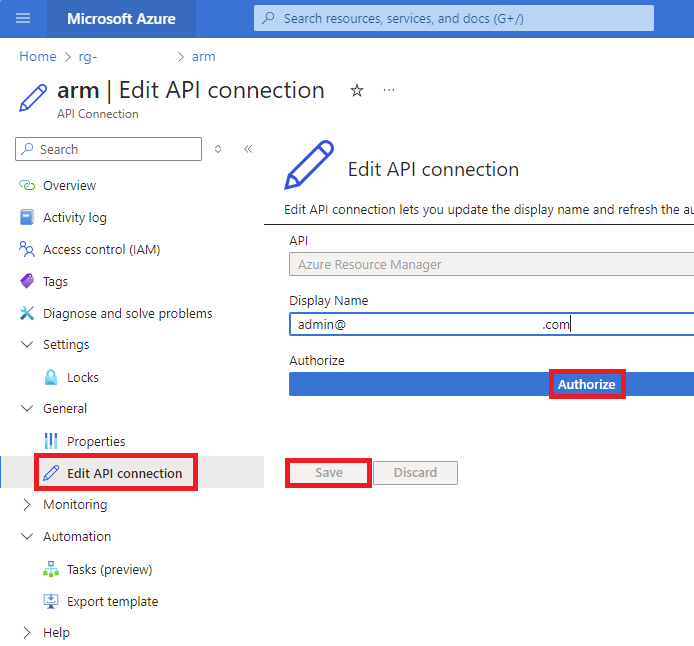

# Fabric-IaC-UKS
This repo is under construction


> [!NOTE]
> The Bicep template (`main.bicep`) contains code to make sure Azure resource names are unique.  If you run the template multiple times you will get multiple resource groups and Fabric Capacities.  Consider deleting resource groups created in error.

-
-

## Work in progress

This repo will create an F2 Fabric Capacity and Logic App to pause it in UK South.  Fabric SKU and region can be altered if required.

Some content sourced from:  
- https://github.com/murggu/fabric-iac
- https://insight-services-apac.github.io/2024/07/23/fabric-bicep

## Steps

1. [Login to Azure CLI:](Login%20to%20Azure%20CLI.md) in Visual Studio Code:
- Open VSCode
- Open a Terminal
- Enter the following text:

```
az login --tenant <your-tenant-id>
```

- Optionally consider using a device code if that does not work:
```
az login --use-device-code
```


2. Set the subscription:

```
az account set --subscription <your-subscription-id>
```


3. Deploy the Bicep file:

```
az deployment sub create --location <location> --template-file bicep/main.bicep
```

Set the parameters `<your-tenant-id>`, `<your-subscription-id>` based on the tenant and subscription you wish to deploy to.  Set `<location>` with the desired Azure region (e.g., uksouth).


4. Authorise the arm connection
- Go to the Azure portal (https://portal.azure.com)
- Select the resource group just deployed
- Select the `arm` API connection
- In the API Connection blade:
- Click **General > Edit API Connection**
- Click **Authorize**
- Click **Save**



5. Now go to the Logic App and run it.  It should complete successfully and pause the Fabric Capacity.
6. Optionally resume the capacity if you are going to work with it now.

## Hints and tips

- if you deploy the template but never authorise the API Connection, the Fabric Capacity will never pause.  Either pause the capacity manually or authorise the connection.

### Convert an ARM template to bicep

1. Export the ARM template from the Azure portal
2. Run the following code to decompile it:

```
az bicep decompile --file main.json
```

See here for more info: https://stackoverflow.com/questions/69354469/is-there-a-way-to-generate-a-bicep-file-for-an-existing-azure-resource


## Steps for migrating workspaces from one sub to another
1. Create new external Azure subscription
2. Add all old workspaces to github repos
3. Create new Fabric capacity in new subscription
